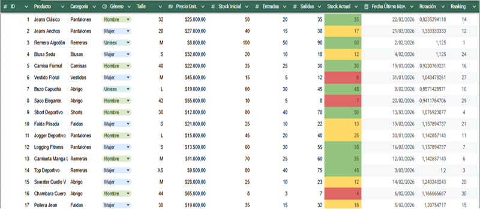
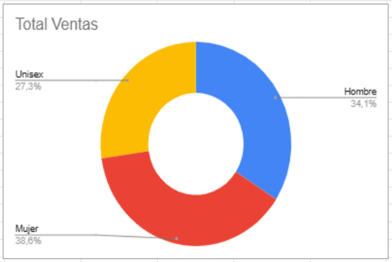
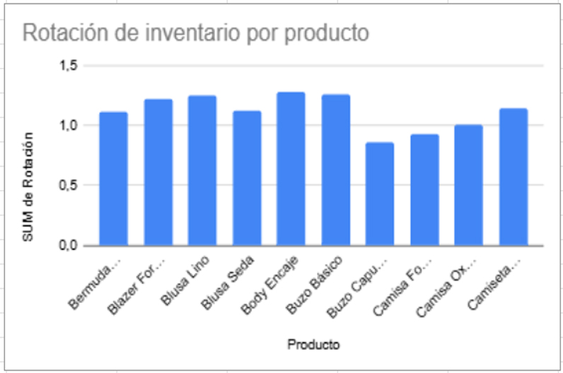
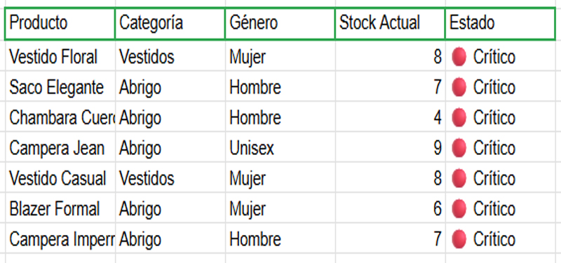

# 📊 Dashboard de Inventario Textil

Proyecto de análisis de inventario y control de stock desarrollado en Google Sheets/Excel.

## 🎯 Objetivos
- Controlar el stock de 30+ productos de indumentaria
- Identificar productos con stock crítico
- Analizar rotación de inventario por categoría y género
- Visualizar datos mediante dashboards interactivos

## 📈 Características
✅ Análisis de rotación de productos  
✅ Alertas automáticas de stock crítico  
✅ Gráficos de distribución por género  
✅ Ranking de productos más vendidos  
✅ KPIs de rendimiento del inventario  

## 🛠️ Herramientas utilizadas
- Google Sheets / Excel
- Formato condicional
- Fórmulas avanzadas (SUMAR.SI, FILTRAR, ARRAYFORMULA)
- Gráficos dinámicos

## 📸 Capturas del Proyecto

### 1️⃣ Vista General del Inventario

**Descripción:**
Tabla principal con productos de indumentaria segmentados por categoría, género y talle.
Incluye cálculo automático de stock actual (Stock Inicial + Entradas - Salidas) y análisis de rotación de inventario. El formato condicional permite identificar visualmente:
- 🟢 Stock saludable (>25 unidades)
- 🟡 Stock medio (10-25 unidades)  
- 🔴 Stock crítico (<10 unidades)

**Función analítica:** Centralización de datos para monitoreo en tiempo real del inventario y 
detección rápida de productos que requieren reposición.

---

### 2️⃣ Distribución de Ventas por Género

**Descripción:**
Gráfico de anillo que muestra la distribución porcentual de las ventas totales segmentadas por género:
- 👩 Mujer
- 👨 Hombre
- 👥 Unisex

**Fórmula utilizada:** `=SUMAR.SI(rango_suma; rango_criterio; criterio)`

---

### 3️⃣ Análisis de Rotación de Inventario

**Descripción:**
Gráfico de barras que compara la rotación de inventario de los principales productos. 
La rotación se calcula como: `Ventas / Stock Promedio`, indicando cuántas veces se renovó el stock en el período analizado.

**Interpretación:**
- 🔵 Rotación > 1.2: Productos de alta demanda
- 🔵 Rotación 0.8 - 1.2: Rotación media estable
- 🔵 Rotación < 0.85: Productos de baja rotación
  
**Aplicación práctica:** 
Identificar productos de alta rotación para priorizar reposición y evitar quiebres de stock, 
mientras que los de baja rotación requieren estrategias de liquidación o reevaluación de compra.

---

### 4️⃣ Alertas de Stock Crítico

**Descripción:**
Tabla filtrada que muestra exclusivamente los productos con stock actual inferior a 10 unidades, 
ordenados por nivel crítico. Esta vista se genera automáticamente mediante la función 
`FILTER()` con condición de stock < 10.

**Fórmula:** `=FILTER(rango_productos; rango_stock<10)`

- ## 👤 Autor
Pablo (https://ar.linkedin.com/in/pablo-chavez-developer)
